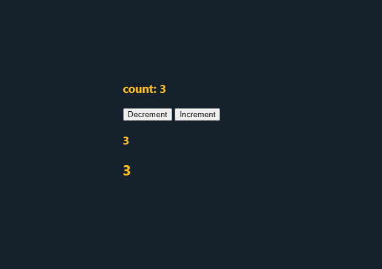

## REACT HOOKS
#### ENG: A Hook in React is a special function that lets our component remember data and respond to changes in a simple and efficient way.
#### 日本語 : ReactのHook（フック）とは、コンポーネントの中でデータを覚えたり、変化に応じて動作させたりするための便利な仕組みです。


### 1. useState
#### What is useState?
useState is a special React hook that lets you add state (temporary data) to your functional components. State means any data your component needs to remember and update — like a counter, form input, or toggle switch.

### useStateとは何ですか？
useStateは、Reactの特別なフックで、関数コンポーネントに ```状態（一時的なデータ)``` を追加することができます。状態とは、カウンターやフォームの入力、トグルスイッチ(true/false)のように、コンポーネントが覚えて更新する必要があるデータのことです。

### 🍽 Real-Life Example (Restaurant Style)
Imagine React is a restaurant, you are the customer (component), and the waiter is the Hook.
1. You (the component) place an order (data or behavior).
2. The waiter (Hook) remembers your order and communicates with the kitchen (React system).
3. If you update your order, the waiter handles it — you don’t have to go to the kitchen yourself.
4. Everything is updated and served back to you (UI updates), smoothly and efficiently.


### 🍽 実生活の例（レストラン編）
React をレストランにたとえてみましょう。あなた（＝コンポーネント）はお客さん、**店員さん（＝Hook）**があなたの注文を聞いてくれる役割です。
1. あなた（コンポーネント）は料理の注文（データや動作）をします。
2. 店員さん（Hook）はその注文を覚えて、キッチン（Reactのしくみ）に伝えてくれます。
3. 注文を変更しても、店員さんが対応してくれるので、自分でキッチンに行く必要はありません。
4. 料理（UIの更新）はスムーズにあなたのところに届きます。


### 2.💡 How to Write `useState`

### 🧠 English

To use `useState`, you need to import it from React first.

### ✅ Syntax:
```js
const [stateVariable, setStateFunction] = useState(initialValue);
```

- stateVariable: The current value (e.g., count)
- setStateFunction: The function to update the value (e.g., setCount)
- initialValue: The initial value for the state (e.g., 0)

### 3. ON VANILLA JAVASCRIPT

```html
<!DOCTYPE html>
<html lang="en">
  <head>
    <meta charset="UTF-8" />
    <meta name="viewport" content="width=device-width, initial-scale=1.0" />
    <link rel="stylesheet" href="src/style.css" />
  </head>
  <body>
    <div>
      <h3 id="count-display">count: 0</h3>
      <button id="decrement">Decrement</button>
      <button id="increment">Increment</button>
      <div>
        <h3 id="count-alert"></h3>
      </div>
      <h2 id="count-text">0</h2>
    </div>

    <script>
      (function () {
        let count = 0;

        const countDisplay = document.getElementById("count-display");
        const countAlert = document.getElementById("count-alert");
        const countText = document.getElementById("count-text");
        const incrementBtn = document.getElementById("increment");
        const decrementBtn = document.getElementById("decrement");

        function updateUI() {
          const displayCount = count <= 0 ? 0 : count;
          countDisplay.textContent = "count: " + displayCount;
          countAlert.textContent = displayCount <= 0 ? "" : displayCount;
          countText.textContent = displayCount;
        }

        incrementBtn.addEventListener("click", () => {
          count++;
          updateUI();
        });

        decrementBtn.addEventListener("click", () => {
          count--;
          updateUI();
        });

        updateUI();
      })();
    </script>
  </body>
</html>
```

### OUTPUT




### 4. ON REACT JS

#### A. Example of Number(Counter)
````javascript
  const StateExample = () => {

  const [count, setCount] = useState(0)

  const handleIncrement = (e) => {
    setCount((e) => e + 1);
  }
  const handleDecrement = (e) => {
    setCount((e) => e - 1);
  }

   return (
    <div>
        <h3>count: {count}</h3>
          <button onClick={handleDecrement}>Decrement</button>
          <button onClick={handleIncrement}>Increment</button>
    </div>
  )
}
export default StateExample

````

#### B. Boolean(Toggle Show/Hide)

````javascript
import { useState } from "react";

const Toggle = () => {
  const [isVisible, setIsVisible] = useState(true);

  return (
    <div>
      <button onClick={() => setIsVisible(!isVisible)}>
        {isVisible ? "Hide" : "Show"}
      </button>
      {isVisible && <p>This is visible!</p>}
    </div>
  );
};


````


#### C. JSON/Object (User Info)


```javascript
import { useState } from "react";

const UserCard = () => {
  const [user, setUser] = useState({
    name: "John",
    age: 25,
    isMember: true,
  });

  return (
    <div>
      <h3>{user.name}</h3>
      <p>Age: {user.age}</p>
      <p>Status: {user.isMember ? "Member" : "Guest"}</p>
      <button
        onClick={() => setUser({ ...user, isMember: !user.isMember })}
      >
        Toggle Membership
      </button>
    </div>
  );
};

```